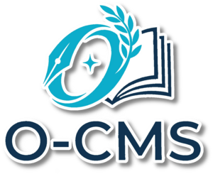

<p align="center">
  
</p>

<h1 align="center">O-CMS</h1>

<p align="center">
  Un CMS flat-file leggero ed elegante, costruito con PHP e JSON. Nessun database necessario.
</p>

<p align="center">
  
  
  
</p>

<p align="center">
  <a href="README.md">English</a> · <strong>Italiano</strong>
</p>

---

## Perch&eacute; O-CMS?

La maggior parte dei CMS richiede MySQL, Composer e una pipeline di deploy complessa. O-CMS segue un approccio diverso: **tutto &egrave; un file JSON**. Carichi la cartella, lanci l'installer, fatto. L'intero sito sta in uno ZIP e si migra copiando una directory.

O-CMS &egrave; ideale per siti personali, progetti scolastici, portali di documentazione, siti di piccole attivit&agrave; e chiunque voglia un CMS potente senza infrastruttura.

---

## Funzionalit&agrave;

### Gestione Contenuti
- **Pagine** &mdash; Pagine statiche con editor WYSIWYG, campi SEO e template personalizzati
- **Articoli** &mdash; Sistema blog completo con categorie, tag, immagini di copertina, excerpt e commenti
- **Lezioni** &mdash; Tipo di contenuto didattico con file allegati (HTML, PDF, video)
- **Quiz** &mdash; Sistema quiz interattivo con domande a risposta multipla e tracciamento risultati
- **Gallerie** &mdash; Gestione gallerie fotografiche con layout griglia e masonry
- **Form** &mdash; Form builder visuale con 10 tipi di campo e notifiche email
- **Commenti** &mdash; Sistema commenti con thread, moderazione e risposte admin

### Amministrazione
- **Pannello Admin dark** &mdash; Interfaccia moderna e responsive in CSS puro
- **Menu Builder** &mdash; Navigazione drag-and-drop con nesting illimitato
- **Media Manager** &mdash; Upload, sfoglia e gestisci file con drag-and-drop
- **Layout Builder** &mdash; Page builder visuale con 18 tipi di modulo (testo, immagini, gallerie, video, card e altro)
- **Ruoli Utente** &mdash; Gerarchia a 5 livelli: Super Admin, Admin, Editor, Publisher, Registrato
- **Analytics** &mdash; Tracciamento visite anonimo integrato con grafici giornalieri
- **Backup e Ripristino** &mdash; Sistema backup completo con migrazione in un click

### Funzionalit&agrave; per Sviluppatori
- **Motore Temi** &mdash; Temi plug-and-play con wizard guidato e import/export ZIP
- **Sistema Estensioni** &mdash; Architettura plugin completa con hook, eventi lifecycle e menu admin
- **API REST** &mdash; Endpoint JSON per articoli, pagine, categorie, menu, impostazioni e altro
- **Motore di Ricerca** &mdash; Ricerca full-text con fuzzy matching, scoring per rilevanza e autocomplete
- **Integrazione AI** &mdash; Generazione contenuti multi-provider (Anthropic, OpenAI, Groq, Mistral, Google)
- **Strumenti SEO** &mdash; Meta tag per pagina, sitemap automatica, robots.txt, code injection

---

## Lingua

Il pannello di amministrazione &egrave; in **italiano**. Il wizard di installazione e i commenti nel codice sono in inglese. Il supporto completo per l'internazionalizzazione (i18n) &egrave; previsto per una versione futura.

---

## Requisiti

| Requisito | Dettagli |
|---|---|
| PHP | 8.0 o superiore |
| Web Server | Apache con `mod_rewrite`, oppure Nginx |
| Estensioni (obbligatorie) | `json`, `mbstring`, `session`, `fileinfo` |
| Estensioni (opzionali) | `zip` (backup), `gd` (ridimensionamento immagini), `curl` (AI, API), `intl` (i18n) |
| Spazio su disco | ~5 MB per il CMS + i tuoi contenuti |
| Database | **Nessuno** |

---

## Avvio Rapido

### 1. Scarica

```bash
git clone https://github.com/b84an/o-cms.git
```

Oppure scarica l'[ultima release](https://github.com/b84an/o-cms/releases) come ZIP.

### 2. Carica sul server

Copia la cartella `o-cms/` nella document root del tuo web server (o in una sottocartella).

### 3. Installa

Apri il browser e vai su:

```
https://tuodominio.com/install.php
```

Il wizard di installazione ti guider&agrave; in 6 step:

1. **Requisiti** &mdash; Verifica versione PHP, estensioni e permessi
2. **Configurazione Sito** &mdash; Nome, URL, lingua, fuso orario
3. **Account Admin** &mdash; Crea il primo amministratore
4. **Email** &mdash; Configurazione SMTP o PHP mail() (opzionale, configurabile anche dopo)
5. **Privacy** &mdash; Informativa trasparente sulla notifica di installazione (opzionale)
6. **Riepilogo** &mdash; Rivedi e conferma

### 4. Elimina install.php

Dopo l'installazione, cancella `install.php` dal server per sicurezza.

### 5. Inizia a creare

Vai su `/admin/` per accedere al pannello di amministrazione e iniziare a costruire il tuo sito.

---

## Struttura Directory

```
o-cms/
├── index.php          # Entry point frontend
├── .htaccess          # URL rewriting
├── core/              # Motore CMS (10 file PHP)
├── admin/             # Pannello admin
├── themes/            # Temi installati
│   └── flavor/        # Tema di default
├── extensions/        # Plugin
├── data/              # Dati JSON (creati dall'installer)
└── uploads/           # File caricati
```

Consulta [ARCHITECTURE.md](ARCHITECTURE.md) per tutti i dettagli su modello dati, flusso richieste, sistema estensioni e API.

---

## Configurazione

Tutte le impostazioni sono salvate in `data/config.json` e modificabili dal pannello admin sotto **Impostazioni**:

- Nome, descrizione e URL del sito
- Selezione tema
- Lingua e fuso orario
- Configurazione email SMTP
- Impostazioni SEO (robots.txt, code injection)
- Configurazione provider AI
- Modalit&agrave; manutenzione

---

## Temi

O-CMS include il tema **Flavor** &mdash; un design pulito e responsive con supporto dark/light mode.

### Creare un Tema

Usa il **Wizard Temi** integrato nel pannello admin, oppure creane uno manualmente:

```
themes/mio-tema/
├── theme.json         # Nome, autore, colori, font
├── assets/
│   ├── css/style.css
│   └── js/app.js
├── partials/
│   ├── header.php
│   └── footer.php
└── templates/
    ├── home.php
    ├── page.php
    ├── article.php
    ├── blog.php
    ├── search.php
    └── 404.php
```

I temi usano variabili CSS per i colori e sono personalizzabili tramite `theme.json`.

---

## Estensioni

Le estensioni aggiungono funzionalit&agrave; attraverso un'architettura basata su hook.

### Creare un'Estensione

Usa il **Wizard Estensioni** nel pannello admin per generare lo scaffolding, oppure crea manualmente:

```
extensions/mia-estensione/
├── extension.json     # Manifest
├── boot.php           # Eseguito ad ogni richiesta (quando attiva)
├── install.php        # Eseguito una volta all'installazione
└── uninstall.php      # Pulizia alla rimozione
```

Le estensioni possono registrare rotte, agganciarsi a eventi e aggiungere voci al menu admin. Consulta [ARCHITECTURE.md](ARCHITECTURE.md) per l'API completa.

---

## API REST

O-CMS include un'API REST JSON per leggere e scrivere contenuti in modo programmatico.

```bash
# Lista articoli
curl -H "Authorization: Bearer IL_TUO_TOKEN" https://tuodominio.com/api/articles

# Crea un articolo
curl -X POST https://tuodominio.com/api/articles \
  -H "Authorization: Bearer IL_TUO_TOKEN" \
  -H "Content-Type: application/json" \
  -d '{"title": "Ciao Mondo", "slug": "ciao-mondo", "content": "<p>...</p>", "status": "published"}'
```

I token API si gestiscono dal pannello admin sotto **API**.

---

## Sicurezza

- Password hashate con bcrypt (`password_hash`)
- Protezione CSRF su tutti i form
- Sanitizzazione input con `htmlspecialchars`
- Directory `data/` protetta da `.htaccess`
- Rigenerazione Session ID dopo il login
- Rate limiting su login, registrazione e commenti
- Captcha matematico sui form pubblici

---

## Notifica di Installazione

O-CMS include una funzionalit&agrave; opzionale e trasparente che invia un **ping anonimo una tantum** quando viene installata una nuova istanza. Serve al maintainer per monitorare l'adozione del progetto.

**Cosa viene inviato:** nome dominio, versione PHP, versione O-CMS.
**Cosa NON viene inviato:** dati personali, indirizzi IP, dati di utilizzo.

La funzione &egrave; completamente opt-in durante l'installazione e pu&ograve; essere disabilitata in qualsiasi momento in `data/config.json` impostando `phone_home_allowed` a `false`.

---

## Contribuire

I contributi sono benvenuti! Sentiti libero di:

1. Forkare il repository
2. Creare un branch (`git checkout -b feature/mia-feature`)
3. Committare le modifiche
4. Pushare il branch (`git push origin feature/mia-feature`)
5. Aprire una Pull Request

Assicurati che il codice segua lo stile esistente e includa commenti appropriati.

---

## Licenza

Licenza MIT. Vedi [LICENSE](LICENSE) per i dettagli.

---

## Autore

Creato da [Ivan Bertotto](https://ivanbertotto.it) &mdash; un docente di informatica che ha costruito questo CMS per dimostrare che non tutto ha bisogno di un database.
